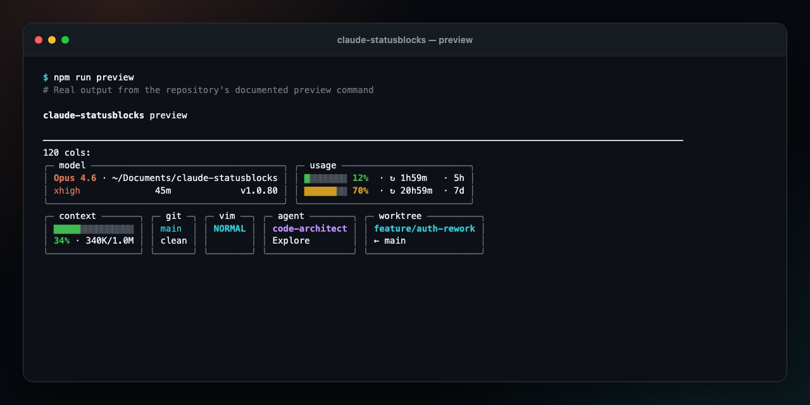

<p align="center">
  
</p>

<p align="center"><em>Real output from <code>npm run preview</code> at 120 columns.</em></p>

# claude-statusblocks

[](https://www.npmjs.com/package/claude-statusblocks)
[](https://github.com/okturan/claude-statusblocks/blob/main/LICENSE)

Adaptive, block-based status line for [Claude Code](https://claude.ai/code). Cards reflow into a pyramid layout based on available terminal width using an exhaustive bin-packing algorithm.

**Zero runtime dependencies.** Pure Node.js built-ins only.

## Install

Requires Node.js ≥ 20. Works on macOS, Linux, and Windows.

```sh
npx claude-statusblocks init
```

This copies the renderer to `~/.claude/statusblocks/` and writes `statusLine.command` into `~/.claude/settings.json` (creating it if needed). Restart Claude Code to activate.

### Update

```sh
npx claude-statusblocks@latest update
```

After v0.4.1, updates happen automatically — the statusline checks for new versions daily in the background. The `postinstall` hook also auto-updates when you run `npm update -g claude-statusblocks`. Set `CLAUDE_STATUSBLOCKS_NO_UPDATE=1` to disable the background check.

### Windows notes

- If `npx` fails in PowerShell with "running scripts is disabled", run the command from **cmd.exe** instead (or use `npx.cmd`). This is npm's PowerShell shim colliding with the default execution policy, not a statusblocks issue.
- Installed with a version before 0.5.0 and the statusline shows nothing? Re-run `npx claude-statusblocks@latest init` — older versions wrote a `statusLine.command` that broke on Windows shells (unquoted backslash paths).

## Cards

| Card | Shows |
|------|-------|
| **context** | Context window fill bar, percentage, used/total token count |
| **model** | Model name, tilde-shortened directory, effort level, session duration, version |
| **promo** | 2x off-peak / peak status with countdown to next transition |
| **git** | Branch, staged/modified counts, lines added/removed |
| **usage** | 5-hour and 7-day rate limit utilization with reset countdowns |
| **vim** | Vim mode indicator (NORMAL/INSERT) |
| **agent** | Active agent name and type when running with `--agent` |
| **worktree** | Worktree branch and original branch when in a `--worktree` session |

Cards appear based on context: `git` only in repos, `promo` only during active rate promotions, `usage` when rate limit data is available (Claude Code ≥2.1.80), `vim`/`agent`/`worktree` only when those features are active.

## Layout

Cards are bin-packed into rows for optimal fit — blocks can be freely reordered across rows. Rows are sorted narrowest-on-top (pyramid shape). The algorithm tries every possible row assignment and picks the layout with fewest rows and most balanced widths.

Row 1 gets extra right margin to avoid overlapping Claude Code's notification panel. On narrow/split-pane terminals, the layout degrades gracefully to stacked single-block rows.

## Configure

`~/.claude-statusblocks.json`:

```json
{
  "segments": ["context", "model", "usage"]
}
```

Or via environment:

```sh
CLAUDE_STATUSBLOCKS_SEGMENTS=context,model,usage
CLAUDE_STATUSBLOCKS_THEME=minimal
```

## Usage data

The `usage` card reads rate limit data directly from Claude Code's `rate_limits` field in the statusline JSON (available since v2.1.80). No external API calls, OAuth tokens, or caching needed.

## Width detection

Claude Code doesn't pass terminal width to status line commands ([#22115](https://github.com/anthropics/claude-code/issues/22115)). Detection cascade: std stream columns → `COLUMNS` env var → cached value → (macOS/Linux only) walk up the process tree to find the parent's TTY via `ps`, query its width with `stty`, fall back to `tput cols` → 120. The spawn-based result is cached per session for 15s so renders don't pay two subprocesses each. On Windows there is no reliable way to query the parent console from a piped child, so it uses `COLUMNS` or the 120 fallback.

## Preview

```sh
npx claude-statusblocks preview
```

## Development

```sh
npm run build       # compile TypeScript
npm run dev         # watch mode
npm test            # run vitest suite
npm run preview     # render with mock data
```

Tests are co-located with source files (`*.test.ts`). The project uses vitest with fake timers for deterministic campaign engine testing.

## License

MIT
